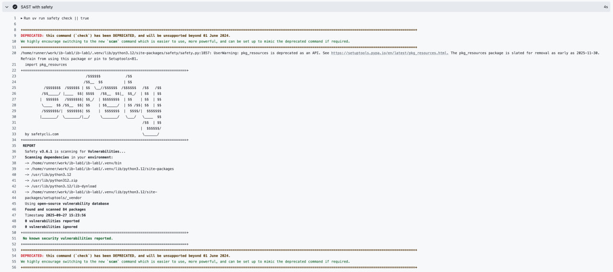
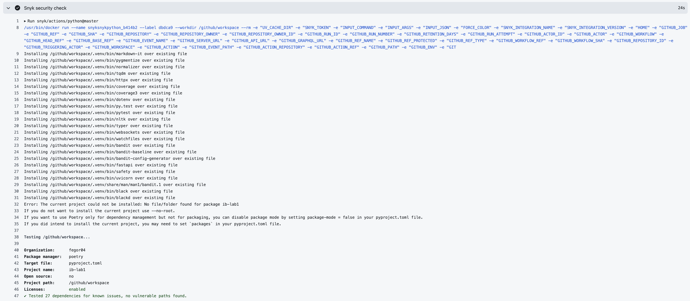

# ib-lab1

Безопасное REST API, построенное на FastAPI, SQLAlchemy и SQLite. Реализует JWT аутентификацию, базовые защиты в соответствии с OWASP Top 10 и CI пайплайн с SAST/SCA.

## Технологический стек
- Python 3.11
- FastAPI + Uvicorn
- SQLAlchemy 2.x + SQLite
- Аутентификация: JWT (PyJWT), хеширование паролей (passlib[bcrypt])
- Санитизация XSS: bleach
- Инструменты: uv (менеджер пакетов/запуск), ruff, black, pytest

## API

### Аутентификация
- POST `/auth/register` — создать пользователя
  - Запрос: `{ "username": string(3-100), "password": string(6-200) }`
  - Ответ: `UserOut { id, username, created_at }`

- POST `/auth/login` — аутентификация
  - Запрос: `{ "username": string, "password": string }`
  - Ответ: `Token { access_token, token_type }`

Используйте заголовок `Authorization: Bearer <token>` для защищенных эндпоинтов.

### Посты
- GET `/api/posts` — список постов
  - Ответ: `PostOut[]` (заголовок/содержимое санитизированы)

- POST `/api/posts` — создать пост
  - Запрос: `{ "title": string(1-200), "content": string(1-4000) }`
  - Ответ: `PostOut`

## Меры безопасности
- SQL Injection: SQLAlchemy ORM с привязанными параметрами; без конкатенации строк SQL.
- XSS: посты санитизируются через `bleach`
- Broken Authentication: JWT-аутентификация с использованием `Authorization: Bearer` с истечением срока действия и HMAC подписью; надежное хеширование паролей с помощью `passlib[bcrypt]`.
- Хранение паролей: хранятся только bcrypt хеши; без открытого текста.

## Тестирование
Интеграционные тесты с использованием `pytest` и `fastapi.testclient`:
```bash
uv run pytest -q
```
Тесты проверяют:
- Регистрацию и вход
- Доступ к `/api/posts` с защитой токеном
- Санитизацию XSS в ответах
- Защита от SQL инъекций

## Скриншоты

Отчет шага SAST (safety)



Отчет шага SCA (snyk)

